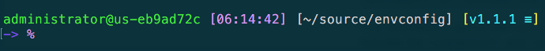

# Configure vim and oh-my-zsh on Linux or macOS

## Requirements
* Vim and zsh should be installed firstly
* If *NOT*, please run script such as `apt-get update && apt-get install -y vim zsh` on linux or `brew install zsh` on mac
* Set zsh as default shell if you want
```
    command -v zsh | sudo tee -a /etc/shells
    sudo chsh -s "$(command -v zsh)" "${USER}"
```

## How to run it
```
    cd ~/
    git clone https://github.com/alexya/envconfig.git
    cd envconfig
    bash setup.sh
```

## What will be installed
* Copy my own customized .vimrc
* Install plug-in management tool of vim through Vundle
* Install some useful plug-ins for vim
* Install oh-my-zsh and use my own configuration

## Screenshot after installation


### References
* More plug-ins could be found from here: http://vimawesome.com/
* Oh-my-zsh https://github.com/robbyrussell/oh-my-zsh
* posh-git-sh https://github.com/lyze/posh-git-sh


# Install and configure development environment
## Install on MacOS
* Git clone the current repo
* Go to the local folder and run the command(s)
    ```
    chmod +x ./mac_install.sh
    ./mac_install.sh
    ```
* The following softwares will be installed
    ```
    nvm
    nodejs
    wget
    ripgrep
    python
    fzf
    lazygit
    neovim
    alacritty
    iterm2
    kdiff3
    font-meslo-lg-nerd-font
    Xcode Command Line Tools
    ```

## Install on Windows
* Git clone the current repo
* Go to the local folder and start a powershell command window with admin privilge, or a normal powershell window and open the privilge manually
* run the command
    ```
    .\win_install.ps1

    Usage: .\setup.ps1 [-tools] [-nvim] [-python] [-7zip] [-kdiff3] [-vsc] [-vs] [-all]

    Options:
      -tools      Install the tools/softwares through Scoop
      -font       Install developer-friendly fonts
      -nvim       Configure for the neovim and alacritty
      -python     Install Python
      -7zip       Install 7zip
      -kdiff3     Install KDiff3
      -vsc        Install Visual Studio Code
      -vs         Install Visual Studio
      -all        Install all above
      -help       Print this help message
    ```
* NOTE: failed to build the LuaSnip plugin so far, refer to https://github.com/LunarVim/LunarVim/issues/4045#issuecomment-1534928815

### References
Refer to: https://github.com/josean-dev/dev-environment-files/tree/main/.config/nvim

### License
This is distributed under the GNU GPL v2.0.
